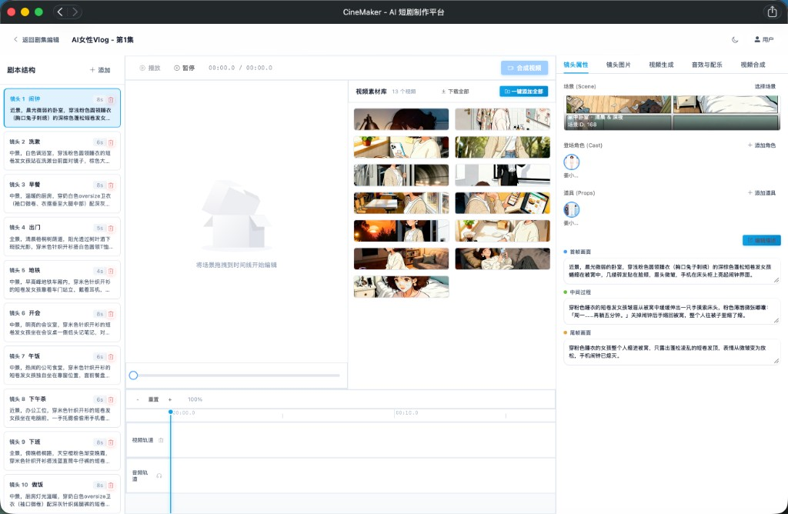

<p align="center">
  
</p>

<p align="center">
  全栈 AI 短剧制作工具 · 从剧本到成片的一站式生产流程
</p>

<p align="center">
  <a href="https://furalike.cn/cinemaker/"><strong>在线体验 Demo</strong></a> ·
  <a href="https://furalike.cn/blog/posts/cinemaker-workflow/"><strong>工作流程详解</strong></a> ·
  <a href="https://www.xiaohongshu.com/discovery/item/6999f9390000000015031bfa?source=webshare&xhsshare=pc_web&xsec_token=AB1YeBV8FFISOWlMopLLgorOWiW83maPlho8zWFMxMoZU=&xsec_source=pc_share"><strong>成片展示（小红书）</strong></a>
</p>

<p align="center">
  
</p>

> 基于 [火宝短剧（huobao-drama）](https://github.com/chatfire-AI/huobao-drama) 二次开发。

## 效果展示

- [成品视频：姜小卷的周一，普通又认真的打工人日常（小红书）](https://www.xiaohongshu.com/discovery/item/6999f9390000000015031bfa?source=webshare&xhsshare=pc_web&xsec_token=AB1YeBV8FFISOWlMopLLgorOWiW83maPlho8zWFMxMoZU=&xsec_source=pc_share)

## PV 角色短片

- [叶澜｜把心事都写进旋律里的吟游诗人](docs/剧本/AI女性Vlog/设计/PV/叶澜｜把心事都写进旋律里的吟游诗人.mp4)
- [夏紫萱｜穿军装驾机甲的二次元少女](docs/剧本/AI女性Vlog/设计/PV/夏紫萱｜穿军装驾机甲的二次元少女.mp4)
- [梅暗香｜穿裙子也能一脚踢翻你](docs/剧本/AI女性Vlog/设计/PV/梅暗香｜穿裙子也能一脚踢翻你.mp4)
- [梅暗香｜穿裙子也能一脚踢翻你-1](docs/剧本/AI女性Vlog/设计/PV/梅暗香｜穿裙子也能一脚踢翻你-1.mp4)
- [温晚｜在音乐里自由落体的慵懒舞者](docs/剧本/AI女性Vlog/设计/PV/温晚｜在音乐里自由落体的慵懒舞者.mp4)
- [陈樱｜在吧台后面看尽人间故事](docs/剧本/AI女性Vlog/设计/PV/陈樱｜在吧台后面看尽人间故事.mp4)
- [顾秋雅｜用鼻子写诗的人](docs/剧本/AI女性Vlog/设计/PV/顾秋雅｜用鼻子写诗的人.mp4)

## 核心特性

- **AI 全流程驱动**：剧本创作 → 分镜生成 → 图片生成 → 图片微调 → 视频生成 → 剪辑合成
- **角色多造型系统**：同一角色多套外貌造型，分镜级别关联，参考图自动匹配
- **两阶段分镜拆分**：先整体方案再逐镜头细化，三段描述（首帧/中间过程/尾帧）分别服务图片和视频模型
- **参考图驱动一致性**：角色三视图、场景四宫格、道具设定图自动注入生成流程
- **图片微调编辑器**：快捷指令（修手部、调表情、改光影等）+ 自然语言局部重绘
- **专业视频编辑器**：时间线拖拽、20+ 转场效果、片段裁剪、键盘快捷键
- **团队协作**：JWT 认证、多团队数据隔离、成员管理
- **存储**：默认本地存储（`./data/storage`），开箱即用；保留 Storage 接口抽象，便于扩展

## 技术栈

| 层级 | 技术 |
|------|------|
| 后端 | Go 1.25, Gin, GORM, SQLite |
| 前端 | Vue 3, TypeScript, Vite, Element Plus |
| AI 服务 | 火山引擎（Seedream 图片 / Seedance 视频）、OpenAI 兼容 API |
| 存储 | 本地文件系统（默认） |
| 部署 | Docker, Docker Compose |

## 快速开始

### Docker 部署（推荐）

前置要求：已安装 [Docker](https://docs.docker.com/get-docker/) 和 [Docker Compose](https://docs.docker.com/compose/install/)。

```bash
git clone <repo-url> && cd cinemaker

docker compose up -d

docker compose logs -f
```

启动后访问：http://localhost:5678

<details>
<summary>国内加速（可选）</summary>

```bash
DOCKER_REGISTRY=registry.cn-hangzhou.aliyuncs.com/library/ \
NPM_REGISTRY=https://registry.npmmirror.com \
GO_PROXY=https://goproxy.cn,direct \
ALPINE_MIRROR=mirrors.aliyun.com \
docker compose up -d --build
```

</details>

**数据持久化**：数据库和上传文件存储在 Docker 命名卷 `cinemaker-data` 中，容器删除后数据不会丢失。

**自定义配置**：取消 `docker-compose.yml` 中配置文件挂载的注释，编辑 `configs/config.yaml` 即可。

### 本地开发

```bash
./start.sh dev        # Docker 热加载模式（推荐）
./start.sh logs       # 查看后端日志
./start.sh stop       # 停止
```

- 后端：`http://localhost:5678`（Go + air 热加载）
- 前端：`http://localhost:3012`（Vite HMR）

详细文档见 [docs/guides/](docs/guides/) 目录。

## 联系方式

- 作者邮箱：s514351508@gmail.com

## 开源说明（Public 版）

- 默认仅使用本地存储路径（`./data/storage`），不依赖腾讯云 COS。
- 运行前请复制 `.env.example` 为 `.env` 并按需填写 AI 服务配置。
- 仓库不包含真实业务数据库与敏感凭据。

## 已实现功能

| 模块 | 功能 |
|------|------|
| 项目管理 | 短剧创建/编辑/删除，11 种视觉风格，多集章节管理 |
| 资源管理 | 角色（手动创建 / AI 提取 / 多造型 / 三视图生成）、场景（四宫格设定图）、道具（AI 提取 + 设定图） |
| 剧本设计 | AI 生成剧本、AI 辅助重写、自动提取角色/场景/道具 |
| 分镜生成 | 两阶段拆分、三段描述（首帧/中间过程/尾帧）、按时长约束对话量、景别/运镜/转场编辑 |
| 图片生成 | 首帧/尾帧/关键帧/分镜板、参考图自动注入、镜头连续性参考帧、AI 提示词生成、中译英翻译 |
| 图片微调 | 快捷编辑指令（修手部/调表情/改光影等）、自然语言局部重绘 |
| 视频生成 | 单图/首尾帧/多图参考/纯文本模式、AI 生成视频提示词、Seedance 1.5 Pro 深度适配 |
| 视频合成 | FFmpeg 合并、20+ 转场效果、时间线拖拽、片段裁剪、音频提取、键盘快捷键 |
| 用户系统 | JWT 认证、团队管理、数据隔离、路由守卫、首次部署自动初始化 |
| 存储 | 本地文件系统（默认）、Storage 接口抽象 |
| 系统功能 | AI 服务多供应商配置、系统监控仪表盘、图片生成 Debug 模式、图片懒加载 |

## 待开发功能

| 功能 | 说明 |
|------|------|
| 团队级 API Key 管理 | 每个团队独立管理 AI 服务密钥，DB 为主、env 仅作初始化种子 |
| 独立语音合成（TTS） | 接入火山引擎豆包语音合成，按角色分别合成语音，自动导入时间线 |
| 开发/部署环境分离 | 同一服务器上独立的开发和生产环境（独立端口、数据库、配置） |

<details>
<summary>暂时隐藏的功能（前端入口已注释，后端 API 保留）</summary>

- **导入剧本（ZIP）**：从 ZIP 文件导入完整剧本。位置：`DramaList.vue`，API：`POST /api/v1/dramas/import`

</details>

## 目录结构

```
├── api/                  # HTTP 路由和处理器
│   ├── handlers/         # 请求处理器（23 个，含 auth、team）
│   ├── routes/           # 路由注册
│   └── middlewares/      # 中间件（JWT 认证、CORS、限流）
├── application/          # 业务逻辑服务层
│   └── services/         # 业务服务（33 个）
├── domain/               # 领域模型
│   ├── models/           # GORM 数据库模型（14 个）
│   └── errors.go         # 领域错误定义
├── infrastructure/       # 基础设施层
│   ├── database/         # GORM + SQLite 连接
│   ├── storage/          # 存储实现（Local，预留扩展接口）
│   └── external/ffmpeg/  # FFmpeg 封装（合成·截帧·转码）
├── pkg/                  # 共享包
│   ├── ai/               # LLM 文本生成客户端
│   ├── asr/              # 语音相关客户端
│   ├── auth/             # 认证上下文、数据隔离 Scope
│   ├── config/           # 配置加载
│   ├── errors/           # 错误处理
│   ├── image/            # 图片生成客户端
│   ├── logger/           # 日志
│   ├── response/         # HTTP 响应封装
│   ├── utils/            # 工具函数
│   └── video/            # 视频生成客户端
├── scripts/              # 运维脚本
│   ├── migrate_to_cos.py # 历史迁移脚本（默认不使用）
│   ├── fix_cos_acl.py    # 历史脚本（默认不使用）
│   └── import_script.py  # 剧本导入工具
├── configs/              # 配置文件
├── migrations/           # 数据库迁移 SQL
├── web/                  # Vue 3 前端
│   └── src/
│       ├── api/          # API 客户端（22 个模块）
│       ├── stores/       # Pinia 状态管理（user、episode）
│       ├── views/        # 页面组件
│       └── components/   # 通用组件（common、editor、resource）
└── main.go               # 入口
```

## 文档

| 文档 | 说明 |
|------|------|
| [产品工作流](docs/guides/1_产品工作流.md) | 以 AI 女性 Vlog 为例，图文讲解从资源准备到成片的全流程 |
| [技术架构](docs/guides/2_技术架构.md) | 系统架构、分层设计、AI 集成、数据模型、提示词工程、部署方案 |
| [提示词指南](docs/guides/3_提示词指南.md) | Seedream 4.0 & Seedance 1.5 Pro 提示词最佳实践 |
| [火山引擎 API 申请指南](docs/guides/4_火山引擎API申请指南.md) | 从零申请火山引擎 API 密钥并在 CineMaker 中完成配置 |
